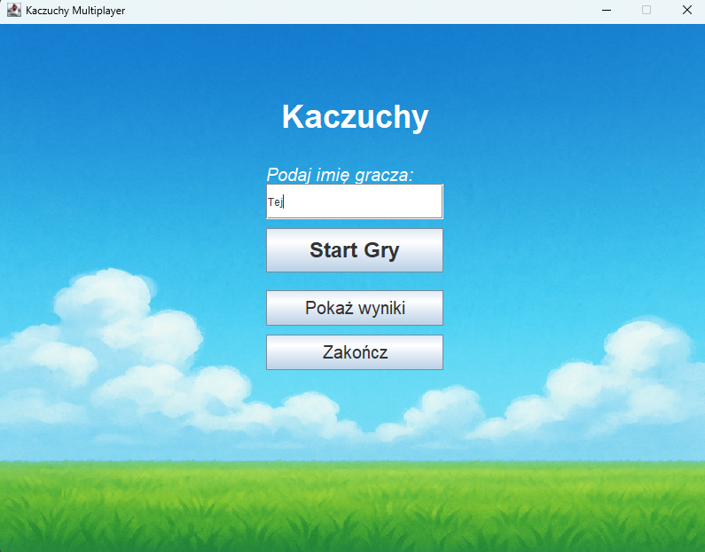
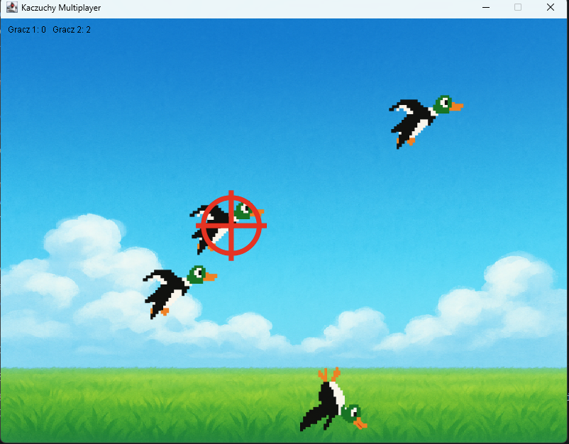
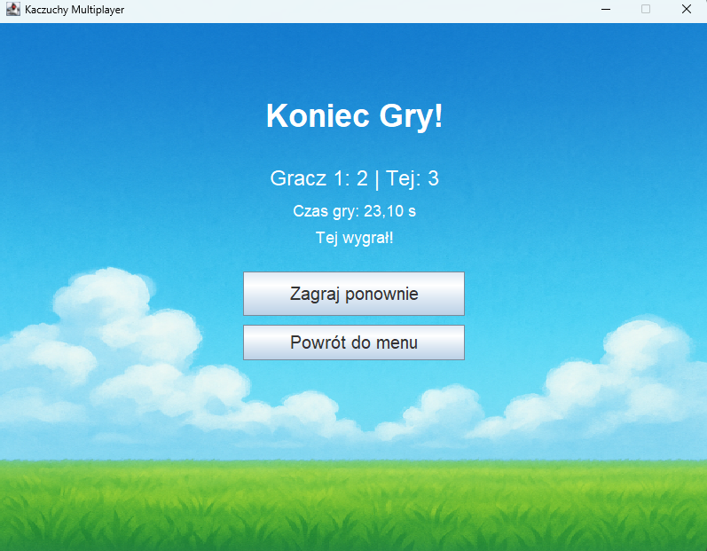

# 🦆 Kaczuchy (Duck Hunt) 🦆
## Java Multiplayer Game

> **Note:** This is a legacy university group project. As it was developed for a local academic environment, the UI, class names, and variables are written in Polish. However, the architectural concepts and network logic follow standard Java practices.

A client-server multiplayer 2D game built entirely in Java. Two players compete in real-time to shoot moving targets (ducks) and score points. The project demonstrates a fundamental understanding of network programming, concurrency, and GUI development in Java.

## Tech Stack & Key Concepts
* **Language:** Java
* **UI Framework:** Java Swing & AWT (CardLayout, Custom Graphics)
* **Networking:** Java Sockets (`ObjectOutputStream` / `ObjectInputStream`)
* **Concurrency:** Multithreading, `Runnable`, Daemon Threads, `LinkedBlockingQueue`, `CopyOnWriteArrayList`
* **Data Persistence:** Local CSV file for high scores (`wyniki.csv`)

## Architecture Highlights
The project uses a strict **Thin Client / Fat Server** architecture:
1. **Server (`SerwerGry`):** Acts as the source of truth. It manages connections on port `5555`, calculates object movements, handles thread synchronization for incoming shots, and broadcasts the current `StanGry` (Game State) 20 times per second to all connected clients.
2. **Clients (`KlientGry` & `OknoGry`):** Completely decoupled from game logic. The client only renders the graphical interface based on the objects received from the server and sends raw user inputs (mouse coordinates) back over the network.

## How to Run the Game locally
Since this is a client-server application, you **must start the server first**, followed by exactly two client instances.

### Step 1: Start the Server
1. Open the project in your IDE (e.g., IntelliJ IDEA / Eclipse).
2. Run the `main` method in the `siec.SerwerGry` class.
3. The console will display: `Serwer nasłuchuje na porcie 5555...`

### Step 2: Start the Clients
1. Run the `main` method in the `main.Main` class to open the first player's window.
2. Run the `main` method in the `main.Main` class *again* to open the second player's window.
3. In both windows:
    * Enter a player name.
    * Click **Start Gry** (Start Game).
4. The server will detect when both players are ready, and the game will begin automatically!

##  Features
* Real-time network synchronization between multiple application instances.
* Custom cursor (crosshair) implementation.
* Score tracking and time-based performance metrics.
* Simple leaderboard generated by reading/writing to a local `.csv` file.

##  Authors
This project was developed as a collaborative academic assignment by:
* **Barbara Wojciechowska**
* **Albert Kruczek**
  
  
  